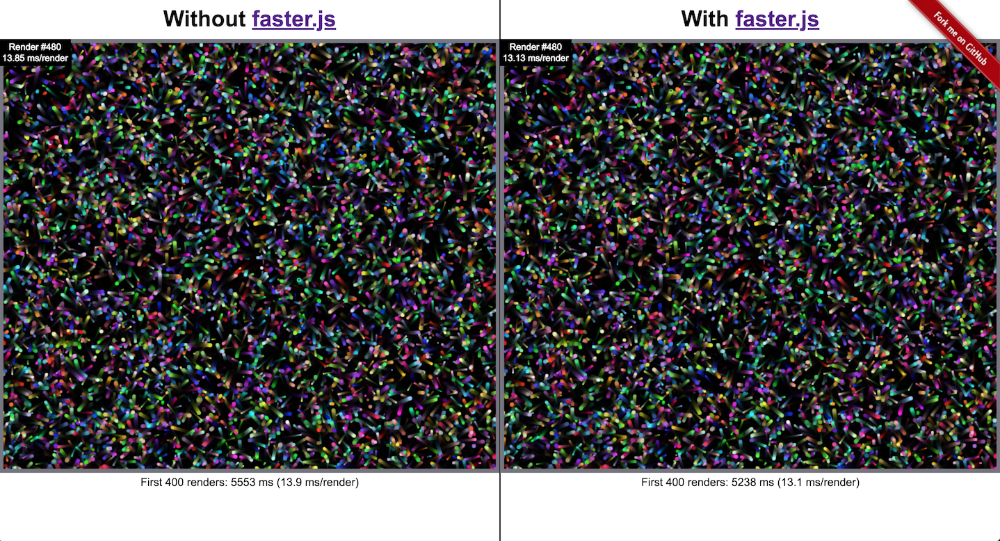

# faster.js Demo

This project is meant to provide a demo of the [faster.js](https://github.com/vzhou842/faster.js) Babel plugin. It compares the performance of some rendering code with and without [faster.js](https://github.com/vzhou842/faster.js).

To run this project:

```shell
npm install # Install dependencies
npm run build # Build client bundles
npm start # Start the server
```

Then visit [http://localhost:3000](http://localhost:3000) in any web browser to see the comparison.


